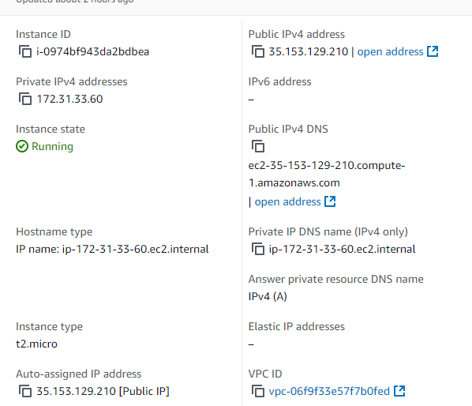

# Parcial 2 Arep

## Arquitectura

El objetivo del proyecto es construir un prototipo con un servicio para realizar búsquedas de manera eficiente, implementando dos algoritmos de búsqueda: Búsqueda Binaria (Binary Search) y Búsqueda Lineal (Linear Search). Estos algoritmos están implementados en dos instancias independientes llamadas Math Service, que se comunican con un servidor proxy. Este servidor proxy utiliza un algoritmo de balanceo de carga (round-robin) para distribuir las solicitudes de forma asincrónica entre ambas instancias de Math Service y devolver los resultados al cliente.

## Despliegue en AWS y Controladores

El despliegue del sistema se realiza en tres instancias en AWS:
1. **Proxy Server**: Recibe las solicitudes del cliente y las distribuye entre los Math Services utilizando el algoritmo de balanceo round-robin.
2. **Math Server 1** y **Math Server 2**: Ambos servidores ejecutan los algoritmos de búsqueda, Binary Search y Linear Search, y responden al Proxy Server con el resultado de la búsqueda solicitada.

### Implementaciones Agregadas

1. **Proxy Server**:
    - **Clase `ProxyController`**: Gestiona las solicitudes de búsqueda. Incluye un método `roundRobin` que envía las solicitudes alternadamente entre las instancias Math Service.
    - **Método de Balanceo Round-Robin**: El algoritmo round-robin asegura que las solicitudes se distribuyan equitativamente entre los dos servidores de Math Service, mejorando la carga y eficiencia del sistema.

2. **Math Server**:
    - **Algoritmos de Búsqueda**:
        - **Binary Search**: Busca un elemento en una lista ordenada utilizando el enfoque de división de la lista a la mitad en cada paso, lo cual es eficiente en términos de tiempo (O(log n)).
        - **Linear Search**: Busca un elemento recorriendo la lista de forma secuencial, útil para listas no ordenadas pero con un rendimiento de O(n).
    - **Controladores en Math Server**: Cada Math Server incluye controladores para recibir solicitudes del Proxy Server y ejecutar el algoritmo de búsqueda correspondiente. Los endpoints `/binarySearch` y `/linearSearch` responden al Proxy Server con el resultado.

3. **Cliente Web**:
    - **Formulario de Interfaz de Usuario**: Permite al usuario ingresar una lista y el valor a buscar.
    - **Función JavaScript** `search(type)`: Envía las solicitudes al Proxy Server, especificando el tipo de búsqueda (Binary Search o Linear Search) y los datos de la lista. La función también muestra el resultado en la interfaz de usuario.
    - **Distribución Asincrónica**: La interfaz permite que el cliente reciba respuestas rápidamente gracias a la distribución de la carga entre los dos Math Services.

### Ejecución y Despliegue

1. **Ejecución de Math Servers**: Las instancias de Math Server deben estar activas y disponibles para recibir solicitudes del Proxy Server en sus respectivos endpoints (`/binarySearch` y `/linearSearch`).
2. **Ejecución del Proxy Server**: El Proxy Server debe estar configurado para redirigir las solicitudes al balanceador round-robin, distribuyendo las consultas de manera equitativa entre las instancias Math Server.
3. **Cliente Web**: El cliente envía sus solicitudes a través de la interfaz web, accediendo al Proxy Server para ejecutar las búsquedas en las instancias de Math Service.

### Capturas de Pantalla

- **Imagen del Proxy Server** con balanceo de carga round-robin:
  

- **Imagen de los Math Servers** con las funciones de búsqueda:
  
  

### Consideraciones Finales

Esta implementación demuestra cómo distribuir la carga de solicitudes entre múltiples servidores de procesamiento, asegurando un sistema escalable y eficiente en el manejo de operaciones computacionales. El uso del balanceo round-robin en el Proxy Server garantiza una gestión equilibrada de las solicitudes, mientras que las dos instancias Math Server proporcionan redundancia y disponibilidad para el servicio de búsqueda.
