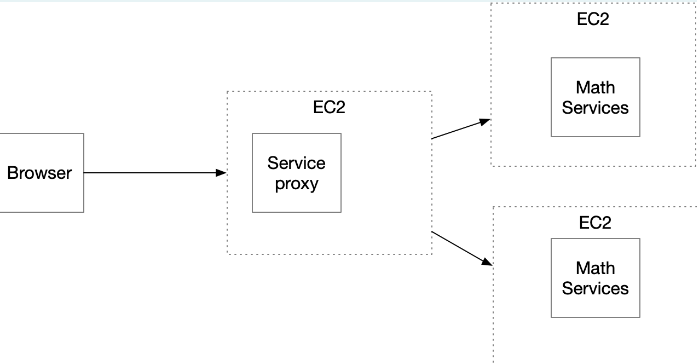
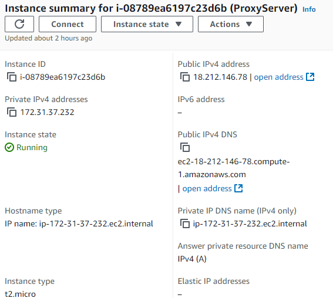
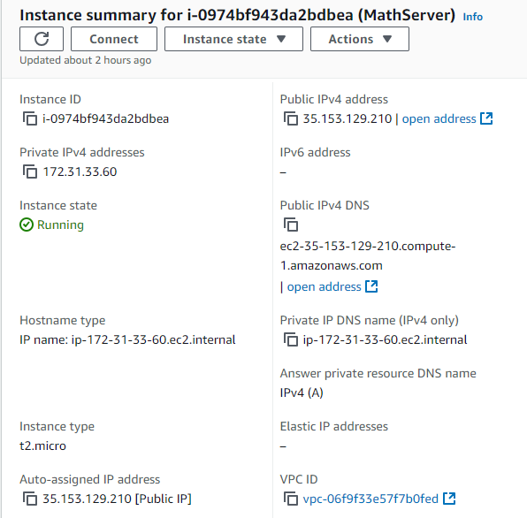

# Parcial 2 Arep

## Arquitectura

Se requiere diseñar uun prototipo que tenga una servicio para computar funciones de ordenamiento, especificamente con dos algoritmos de busqueda, Binary Search y Linear Search siendo desplegado en dos instancias de Math Service independientes con las mismas funciones, con la particularidad de que ewstas se comunican con un servidor proxy el cual cuenta con un algoritmo de balanceo llamado roundrobin, donde este este mismo se encarga de repartir las solicitudes del cliente de forma asincron y hacer las consultas a Math service.

## Despliegue AWS y controladores 

Se crearon dos proyectos Server, Math Server donde el primero actua como servidor proy usando round robin para hacer consultas a las dos instancias de math service 

El segundo es Math server el cual implementa las busquedas tanto binaria como lineal

